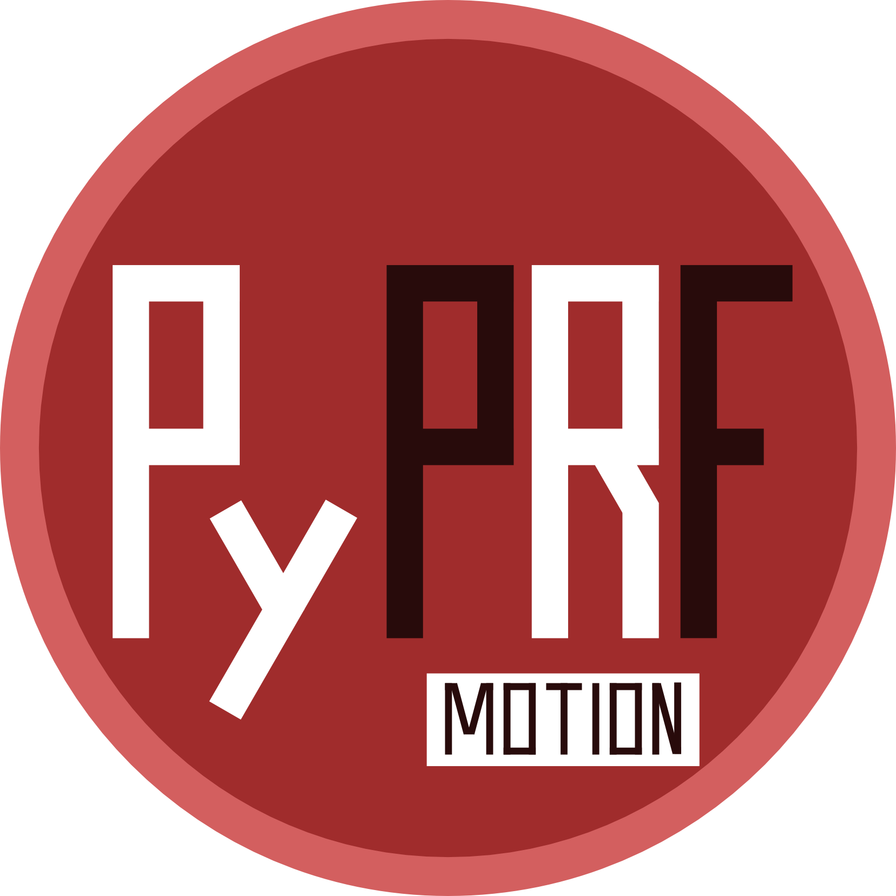
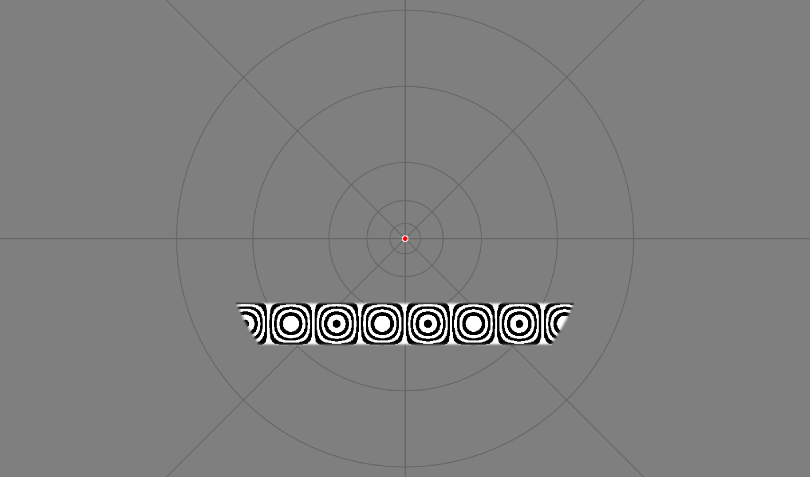

# pyprf_motion

Population receptive field analysis for motion-sensitive early- and mid-level visual cortex.

This is an extension of the [pyprf package](https://github.com/ingo-m/pypRF)
Compared to pyprf, pyprf_motion offers stimuli that were specifically optimized to elicit responses from motion-sensitive areas.
On the analysis side, pyprf_motion offers some additional features made necessary by the different stimulation type (sub-TR temporal resolution, cross-validation) at the cost of speed and some flexibility.

## Dependencies
[**Python 2.7**](https://www.python.org/download/releases/2.7/)

| Package                              | Tested version |
|--------------------------------------|----------------|
| [NumPy](http://www.numpy.org/)       | 1.11.1         |
| [SciPy](http://www.scipy.org/)       | 0.18.0         |
| [NiBabel](http://nipy.org/nibabel/)  | 2.0.2          |

## How to use
1. Record fMRI data: The PsychoPy scripts in the stimulus_presentation folder can be used for presenting appropriate visual stimuli.

2. Prepare the PNG presentation files

3. Prepare the input data: The input data should be motion-corrected, high-pass filtered and demeaned. If desired, distortion correction and temporal as well as spatial smoothing can be applied. The PrePro folder contains some auxiliary scripts to perfom some of these functions, using either fsl or python functions.

4. Adjust the pRF_config: Adjust the inputs to the "pRF_config.py" file in the Analysis folder, such that the provided information is correct.

5. Run the pRF_main.py script: Open a terminal, navigate to the Analysis folder, containing the "pRF_main.py" script and run "python pRF_main.py". If desired, a custom made pRF_config.py script can additionally be provided by running "python pRF_main.py path/to/custom_config.py". If no custom config script is provided, the pRF_main script will default to the pRF_config.py file in the Analysis folder.

## References
This application is based on the following work:

* Dumoulin, S. O., & Wandell, B. A. (2008). Population receptive field estimates in human visual cortex. NeuroImage, 39(2), 647–660. https://doi.org/10.1016/j.neuroimage.2007.09.034

* Amano, K., Wandell, B. A., & Dumoulin, S. O. (2009). Visual field maps, population receptive field sizes, and visual field coverage in the human MT+ complex. Journal of Neurophysiology, 102(5), 2704–18. https://doi.org/10.1152/jn.00102.2009

* van Dijk, J. A., de Haas, B., Moutsiana, C., & Schwarzkopf, D. S. (2016). Intersession reliability of population receptive field estimates. NeuroImage, 143, 293–303. https://doi.org/10.1016/j.neuroimage.2016.09.013 

## License
The project is licensed under [GNU General Public License Version 3](http://www.gnu.org/licenses/gpl.html).
